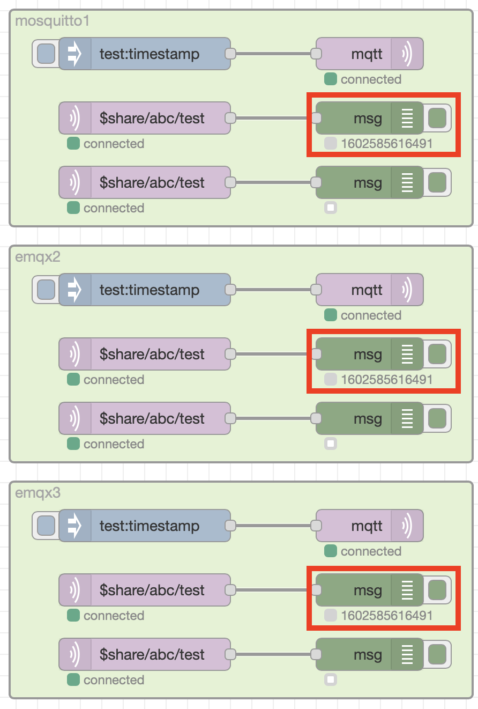

# Bridging Brokers

MQTT broker bridging is another mechanism available to distribute loads over multiple brokers.

A bridge is a broker to broker connection with a set of rules that specify what messages are sent across the bridge.  The rules can specify if messages matching a rule can only flow in 1 direction, or if they can flow in both directions across the bridge.  This allows messages published to one broker to be delivered to clients connected to a different broker.

Care must be taken when using bridges to ensure that the bridges do not form loops, where a message could be perpetually sent between brokers in a never ending loop.

Many clustered brokers also support MQTT bridges.  However, when brokers not supporting clustering scale using bridges alone then individual brokers are single points of failure.

In the test configuration broker 1 and 2 have bridges to broker 3, allowing all messages to pass both ways across the bridge.  A bridge will ensure a message sent across the bridge in one direction does not get sent back to the original broker, but this doesn't apply when crossing multiple bridges.  But a message arriving on a broker across the bridge will also be forwarded across any other bridge configured on the receiving broker.

If Broker 3 fails then messages published to Broker 1 will no longer be received on Broker 2

## Loops

If another bridge was introduced between brokers 1 and 2 then:

- a message published to broker 1 would be sent to brokers 2 and 3
- the message arriving at broker 2 wouldn't be sent to back across the bridge to broker 1, but it would be sent across the bridge to broker 3
- the message arriving at broker 3 wouldn't be sent back across the bridge to broker 1, but it would be sent across the bridge to broker 2

At this point brokers 2 and 3 each have 2 copies of the message originally published to broker 1.  Now with the message on broker 2, which arrived via broker 3, now on it's second hop (Broker 1 -> Broker 3 -> Broker 2), the message wouldn't be sent back to broker 3, but would be sent to broker 1 - and so the loop continues.  Similarly the message sent to broker 3 from broker 2 would also then be forwarded to Broker 1.  Each message would end up on this perpetual loops causing a message storm, which will overwhelm all the brokers.

## Shared Subscriptions and Bridges

Shared subscriptions do not work across bridges, so clients connecting to a broker with the same shared subscription will only share messages with other clients belonging to the same broker.

To see this look at the test deployment.  When a single message is published then 1 client on each broker receives the message, as the message is sent across the 2 bridges so all brokers receive the message.  They then forward it to 1 client in the shared subscription group on each broker, so as there are 3 brokers, 3 clients receive the message.

{style="width: 60%" .center}

compare that with the EMQX broker, which is clustered rather than using bridges, where the shared subscriptions are cluster wide, so when a message is published to the broker then only a single client with the shared subscription will receive the message.

Using shared subscriptions in conjunction with bridges does add some additional constraints, where all clients belonging to a shared subscription need to connect to the same broker.
