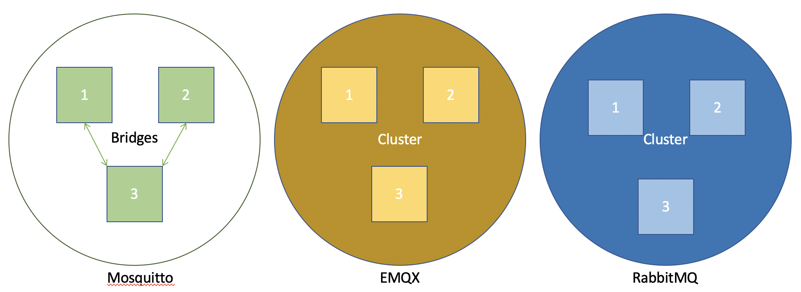
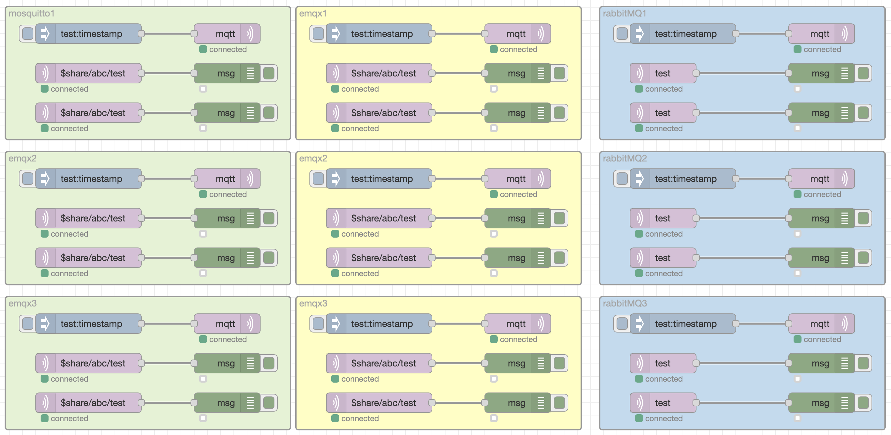
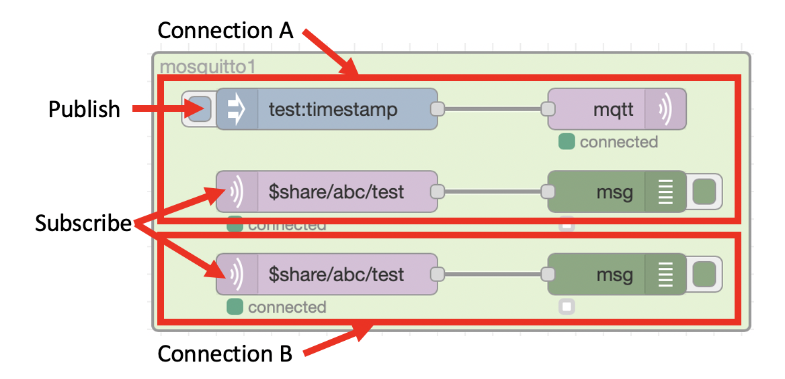

# Deploying the brokers

The scripts in this repository should allow you to setup the 3 brokers, so you can experiment and test the various brokers options and configurations.

## Prerequisites

The scripts provided rely on Docker, so you need to have an up to date version of [Docker](https://www.docker.com/get-started) installed on your system.

The scripts provided have been tested on up to date versions of Linux (using bash shell), MacOS and Windows 10 (using Command prompt)

This project assumes you know the basics of MQTT, it is not an MQTT tutorial.

## Running the scripts

The deploy script will setup a Docker network then deploy 3 instances of each of the brokers included in the test.  For EMQX and Rabbit MQ the brokers will be configured as a cluster.  Mosquitto has 2 bridges configured to transfer messages between brokers 1 and 3 and 2 and 3.  All topics can cross the bridges in both directions.

{style="width: 80%" .center}

A Node-RED instance is then deployed with a test flow added.  This Node-RED flow allows you to test each of the broker configurations, as there are 2 connections made to each of the 3 instances of broker.  Where the broker supports shared subscriptions, the Node-RED node will create a shared subscription.

{style="width: 80%" .center}

Each shaded box represents 1 broker, and each of the MQTT-in nodes has their own connection to the broker, with a subscription to the **test** topic

The Inject nodes publishes a message to the **test** topic on the connected broker and the debug nodes allow you to see which MQTT clients received that message.

{style="width: 60%" .center}

### Running the test

To run the test simply run **deploy.sh** (on Linux or MacOS) in a terminal window or **deploy.bat** (on Windows) in a command window.

This will deploy the brokers and Node-RED as Docker containers.

### Accessing Node-RED

To access the Node-RED user interface you can launch a browser on the same system running the Docker containers and browse to [http://localhost:1880](http://localhost:1880){target=_blank}

### Testing each broker

You can use the button on the inject nodes to publish a message to a specific instance of a broker, then use the debug node status or output in the debug panel to see which client connection(s) received the message.

You should see that each broker produces different results, with the different capabilities and configurations of the brokers under test.

### Tidying up

Once you have completed the testing you can run the cleanup.sh or cleanup.bat script to delete all the containers and the Docker network configuration.

!!! Warning
    If you made any changes to the Node-RED flow, then running the cleanup script will delete the container and you will loose the modified Node-RED flow

## Configuration files

The brokers and Node-RED flow are configured and initialised using files from the **files** folder in this project.  At deploy time a new directory is created called **data**, and content from the **files** folder is copied to the data folder.  Content from the **data** folder is mapped into the running docker containers to make configuration available to the brokers and Node-RED.

You will see the EMQX and RabbitMQ brokers share a common configuration across all brokers, with environment variables or command line options being used to pass in parameters unique to each broker, such as the broker name.  

The Mosquitto brokers each have a unique configuration files, as the bridges configuration is within the configuration files.

The Node-RED flow is fully populated, including passwords, from the config.json, flows.json and flows_cred.json files.  If you modify the Node-RED flow and want to save the changes, then you should save the files from the **data** directory before running the *cleanup* script.  In the **data** folder the config.json file has a leading *full stop* character, so is actually called **.config.json** and may be hidden in your file explorer application.
