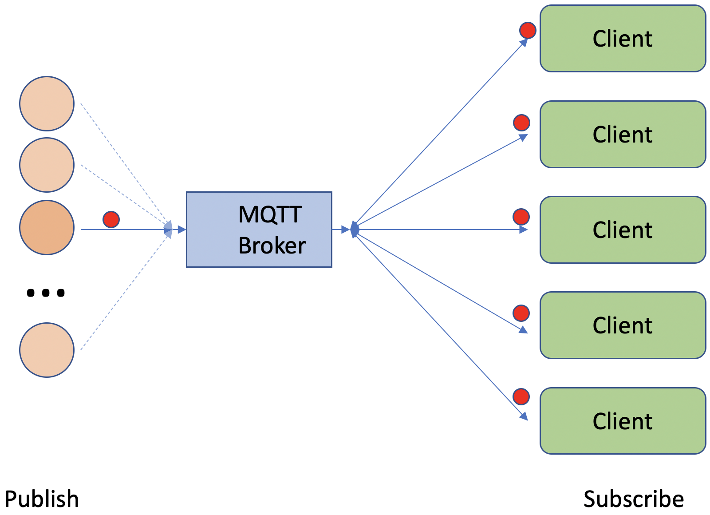
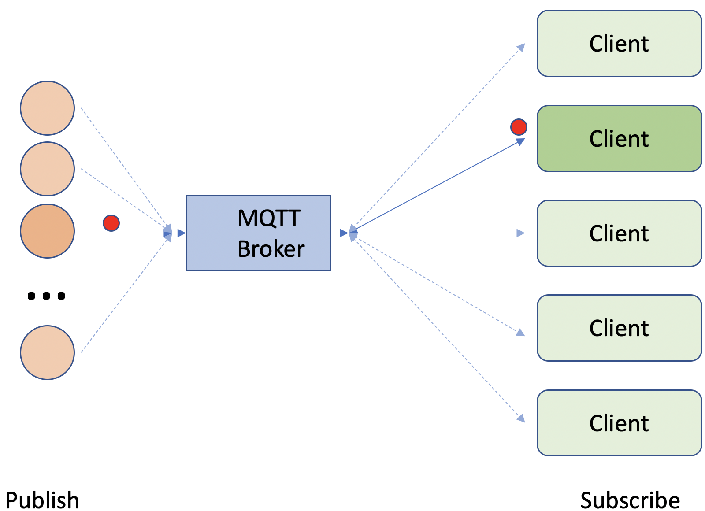

# Shared Subscriptions

Version 5 of the MQTT specification introduced shared subscriptions.  A a number of brokers added their own custom shared subscription capability before v5 of the MQTT standard was released, so you may come across alternate shared subscription mechanisms.

The MQTT v5 standard shared subscription works by pre-pending **$share/\<group\>/** to the topic.

Subscribing to the topic **$share/abc/test** means the client has subscribed to receive messages published to topic **test**, but in a shared subscription group named **abc**.

All clients using the same subscription group and topic will belong to the same shared subscription, which results in only 1 client in the group receiving each published message to the subscribed topic.

| Standard Subscription | Shared Subscription |
|-----------------------|---------------------|
|  |  |
| All clients get all messages | A single client gets each message |

## Why use shared subscriptions?

Shared subscriptions are really useful when an applications needs to be scaled using horizontal scaling, where additional instances of an application are run and clients are load balanced between the instances.  Horizontal scaling is the standard mechanism used to scale workloads in cloud computing.  Applications can be scaled to cope with load and/or to ensure resilience.

Without shared subscriptions all instances of an app receive a copy of every message.  For some applications this is desirable, but for many applications this can result in duplicate work being done, but also duplicate data being created, which is undesirable and left to the application design or implementation to work around.
